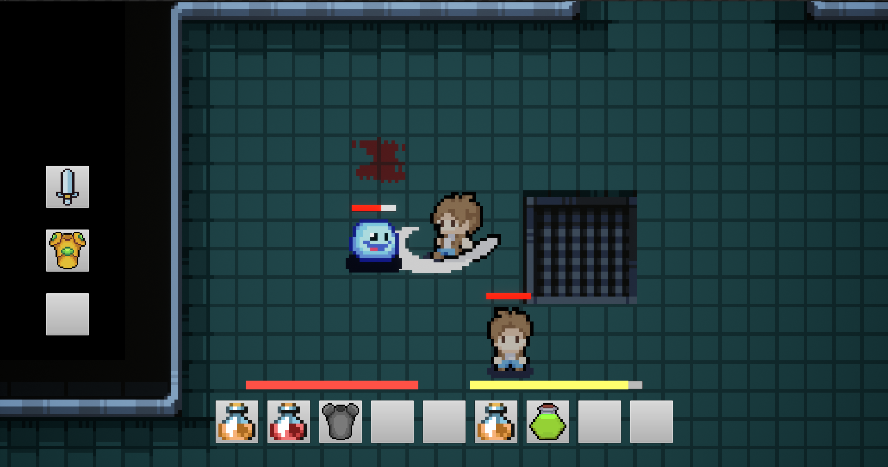
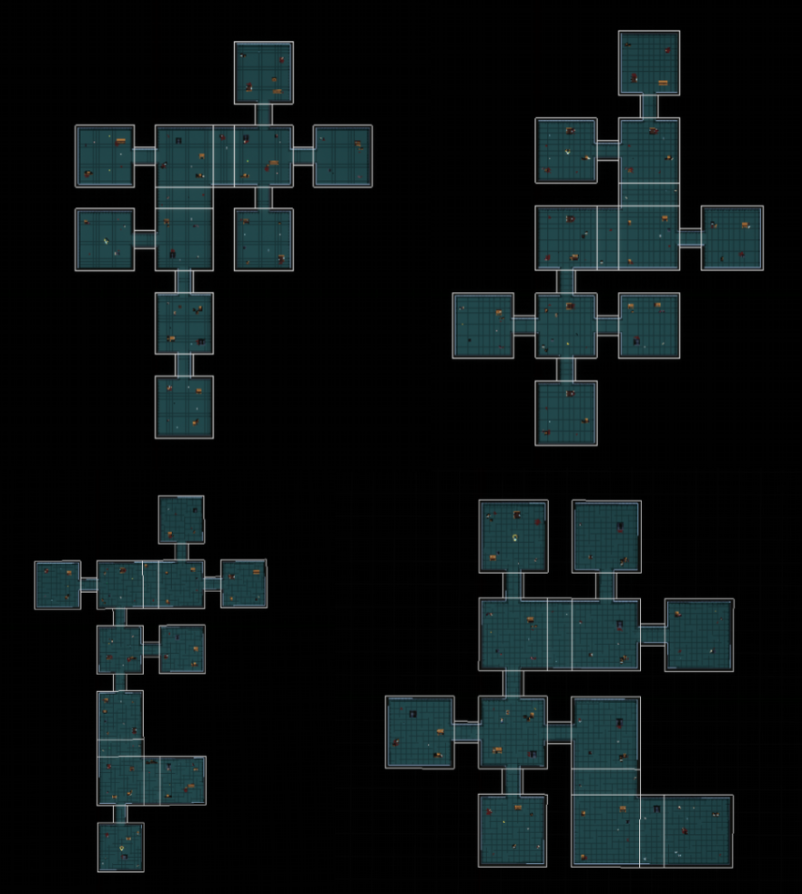

# roguelike-game

## Project Description:

Roguelike game with procedural dungeon generation and multiplayer. The player controls the character, fights enemies with swords and finds valuable items in chests and on the map. The game has various types of weapons, equipment, character attributes and potions that restore health and stamina. The game ends when the player reaches the last level and defeats the boss. The player will have to restart the game if they die, in the tradition of the roguelike genre.

## Screenshots:

    
    

## Controls:

| Buttons | Action | 
| --- | --- | 
| `W` | Move forward | 
| `A` | Move left | 
| `S` | Move backward |
| `D` | Move right | 
| `E` | Interact with items |
| `1-9` | Use items |
| `Left mouse click` | Attack enemies |
| `Middle mouse click` | Show cursor |
| `Escape` | Open the game menu during a game / Close the chest | |

## Project build:

Install [Unreal Engine 4.27](https://www.unrealengine.com/en-US/download).

Clone the project by first installing the [Git LFS](https://git-lfs.com/) plugin. 

Next, select the option “Generate visual studio project files” in the context menu of the .uproject file and choose the 4.27 version of Unreal Engine.

Open .uproject file and compile the project in editor or IDE. 
